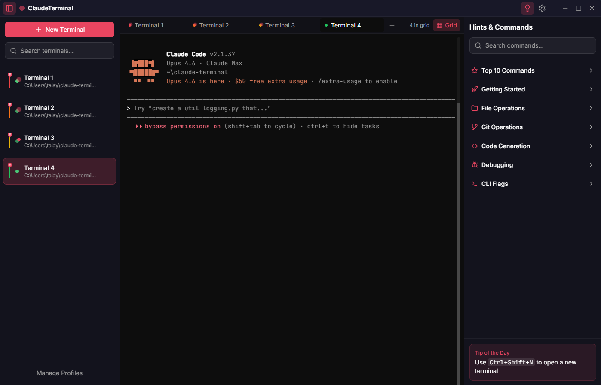
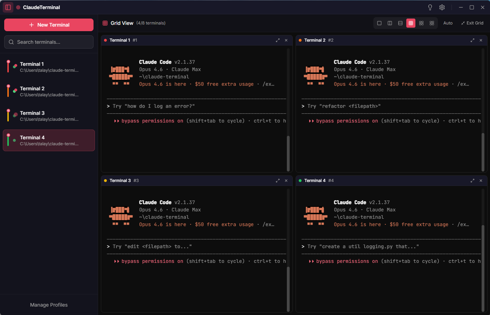
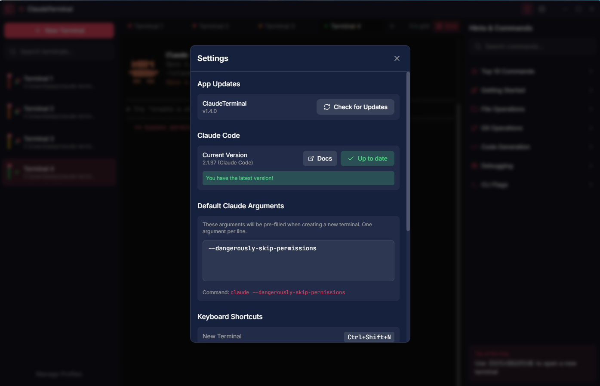
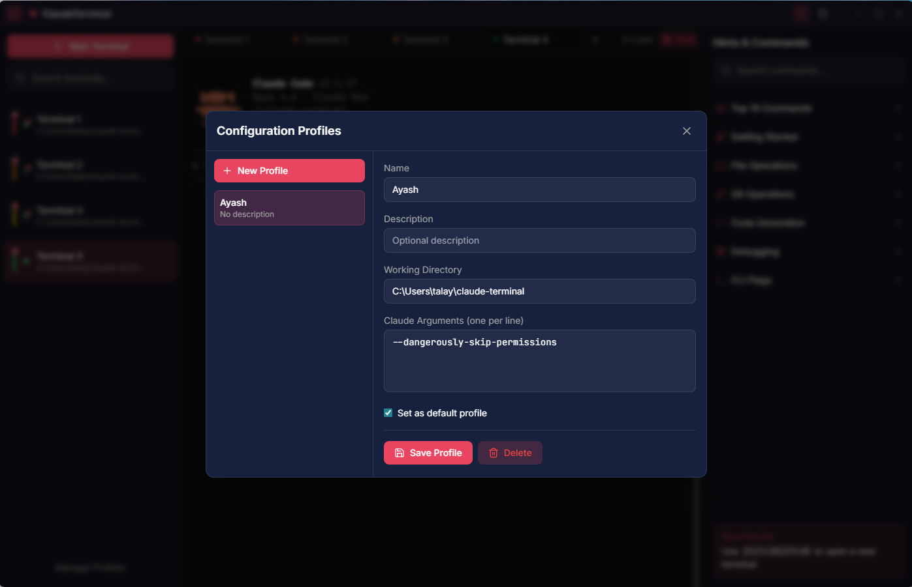

<p align="center">
  
</p>

<h1 align="center">ClaudeTerminal</h1>

<p align="center">
  <strong>A Modern Multi-Instance Terminal Manager for Claude Code</strong>
</p>

<p align="center">
  <a href="#features">Features</a> •
  <a href="#installation">Installation</a> •
  <a href="#usage">Usage</a> •
  <a href="#keyboard-shortcuts">Shortcuts</a> •
  <a href="#building-from-source">Build</a> •
  <a href="#license">License</a>
</p>

<p align="center">
  
  
  
  
  
</p>

---

## Overview

**ClaudeTerminal** is a sleek, modern Windows desktop application designed to help developers manage multiple [Claude Code](https://docs.anthropic.com/en/docs/claude-code) terminal instances from a unified interface. Built with Tauri and React, it provides a powerful workspace for running parallel Claude Code sessions with custom configurations, real-time monitoring, and intelligent command assistance.

## Screenshots

<p align="center">
  
  <br><em>Main view with sidebar, tabs, and hints panel</em>
</p>

<p align="center">
  
  <br><em>Grid view with 4 terminals running simultaneously</em>
</p>

<p align="center">
  
  <br><em>Settings — updates, arguments, and keyboard shortcuts</em>
</p>

<p align="center">
  
  <br><em>Configuration profiles for quick-launch setups</em>
</p>

## Features

### 🖥️ Multi-Terminal Management
- Create, manage, and monitor multiple Claude Code instances simultaneously
- Tab-based interface with drag-and-drop reordering
- Color-coded terminals for easy identification
- **Custom nicknames** for easy terminal identification
- Session state persistence across restarts

### 📐 Smart Grid View
- View up to **8 terminals simultaneously** in a single window
- Intelligent auto-layout (1x1, 1x2, 2x2, 2x3, 2x4, etc.)
- Click to focus, keyboard navigation with arrow keys
- Quick add/remove terminals from grid via context menu
- Toggle grid mode with `Ctrl+G`

### 🎨 Modern UI/UX
- Beautiful dark glassmorphic design
- Smooth animations powered by Framer Motion
- Custom window controls with transparent titlebar
- Responsive and intuitive interface

### ⚙️ Configuration Profiles
- Save and load custom terminal configurations
- Pre-configure Claude Code CLI flags per profile
- Set environment variables for each session
- Quick-launch favorite configurations

### 💡 Command Hints & Tips
- Built-in command reference panel
- Categorized hints for common operations
- One-click copy to clipboard
- Searchable command database

### 🔄 Auto-Setup Wizard
- Automatic detection of system requirements
- Guided installation for Node.js and Claude Code
- One-click Claude Code installation
- System status monitoring

### 🔄 Auto-Updates
- Automatic update checks on startup
- Background download with progress indicator
- One-click update installation
- Manual update check in Settings

### ⌨️ Productivity Features
- Comprehensive keyboard shortcuts
- Search and filter terminals
- Rename terminals inline
- Quick actions menu

## Installation

### Prerequisites

Before installing ClaudeTerminal, ensure you have:

1. **Node.js** (v18 or higher) - [Download](https://nodejs.org/)
2. **Claude Code** - Install via npm:
   ```bash
   npm install -g @anthropic-ai/claude-code
   ```

### Download

Download the latest release for Windows from the [Releases page](https://github.com/talayash/claude-terminal/releases/latest):

| Installer Type | Description |
|---------------|-------------|
| [ClaudeTerminal_1.7.2_x64-setup.exe](https://github.com/talayash/claude-terminal/releases/latest/download/ClaudeTerminal_1.7.2_x64-setup.exe) | NSIS Installer (Recommended) |
| [ClaudeTerminal_1.7.2_x64_en-US.msi](https://github.com/talayash/claude-terminal/releases/latest/download/ClaudeTerminal_1.7.2_x64_en-US.msi) | MSI Installer |

### First Launch

1. Run the installer and follow the setup wizard
2. Launch ClaudeTerminal from the Start Menu or Desktop
3. If Claude Code is not detected, the setup wizard will guide you through installation
4. Click "New Terminal" to create your first Claude Code session

## Usage

### Creating a Terminal

1. Click the **"New Terminal"** button in the sidebar, or press `Ctrl+Shift+N`
2. Select a **profile** from the dropdown (or use Default)
3. Optionally set a **nickname** for easy identification
4. Choose the **working directory** for the session
5. Configure **Claude arguments** (e.g., `--dangerously-skip-permissions`)
6. Click **Create Terminal** - Claude Code starts automatically!

### Managing Terminals

- **Switch terminals**: Click on a tab or sidebar item
- **Rename**: Double-click the terminal name or use the context menu
- **Close**: Click the X on the tab or select "Close" from the context menu
- **Search**: Use the search bar in the sidebar to filter terminals

### Configuration Profiles

1. Click **"Manage Profiles"** in the sidebar footer
2. Create a new profile with:
   - Name and description
   - Working directory
   - Claude Code arguments (e.g., `--model opus`, `--verbose`)
   - Environment variables
3. Save and use the profile for new terminals

### Hints Panel

Press `F1` or click the lightbulb icon to open the Hints panel:
- Browse categorized Claude Code commands
- Click any hint to copy it to clipboard
- Use the search bar to find specific commands

## Keyboard Shortcuts

| Shortcut | Action |
|----------|--------|
| `Ctrl+Shift+N` | New Terminal |
| `Ctrl+W` | Close Current Terminal |
| `Ctrl+B` | Toggle Sidebar |
| `F1` | Toggle Hints Panel |
| `Ctrl+,` | Open Settings |
| `Ctrl+Tab` | Next Terminal |
| `Ctrl+Shift+Tab` | Previous Terminal |
| `Ctrl+G` | Toggle Grid View |
| `Ctrl+Shift+G` | Add Current Terminal to Grid |
| `Ctrl+C` | Copy selected text / Send interrupt signal |
| `Ctrl+V` | Paste from clipboard |
| `Arrow Keys` | Navigate Grid (when in grid mode) |

## Building from Source

### Prerequisites

- [Node.js](https://nodejs.org/) v18+
- [Rust](https://rustup.rs/) (latest stable)
- [Visual Studio Build Tools](https://visualstudio.microsoft.com/visual-cpp-build-tools/) (Windows)

### Steps

1. **Clone the repository**
   ```bash
   git clone https://github.com/talayash/claude-terminal.git
   cd claude-terminal
   ```

2. **Install dependencies**
   ```bash
   npm install
   ```

3. **Run in development mode**
   ```bash
   npm run tauri dev
   ```

4. **Build for production**
   ```bash
   npm run tauri build
   ```

   The installers will be available in:
   - `src-tauri/target/release/bundle/nsis/` (NSIS installer)
   - `src-tauri/target/release/bundle/msi/` (MSI installer)

## Tech Stack

| Layer | Technology |
|-------|------------|
| Framework | [Tauri](https://tauri.app/) 2.x |
| Backend | Rust |
| Frontend | React 18 + TypeScript |
| Styling | Tailwind CSS |
| Animations | Framer Motion |
| Terminal | xterm.js |
| State | Zustand |
| Icons | Lucide React |
| Build | Vite |

## Project Structure

```
claude-terminal/
├── src/                    # React frontend
│   ├── components/         # UI components
│   ├── store/             # Zustand stores
│   └── hooks/             # Custom hooks
├── src-tauri/             # Tauri backend
│   ├── src/               # Rust source files
│   │   ├── main.rs        # Application entry
│   │   ├── terminal.rs    # Terminal management
│   │   ├── commands.rs    # Tauri commands
│   │   ├── config.rs      # Configuration
│   │   └── database.rs    # SQLite database
│   └── icons/             # Application icons
└── package.json           # Node dependencies
```

## Troubleshooting

### Claude Code not detected

1. Ensure Node.js is installed: `node --version`
2. Install Claude Code globally: `npm install -g @anthropic-ai/claude-code`
3. Restart ClaudeTerminal

### Terminal not responding

1. Check if Claude Code is properly authenticated
2. Try closing and reopening the terminal
3. Check the Claude Code logs for errors

### Build errors

1. Ensure Rust is installed: `rustc --version`
2. Update Rust: `rustup update`
3. Clean and rebuild: `cargo clean && npm run tauri build`

## Contributing

Contributions are welcome! Please feel free to submit a Pull Request.

1. Fork the repository
2. Create your feature branch (`git checkout -b feature/amazing-feature`)
3. Commit your changes (`git commit -m 'Add amazing feature'`)
4. Push to the branch (`git push origin feature/amazing-feature`)
5. Open a Pull Request

## License

This project is licensed under the MIT License - see the [LICENSE](LICENSE) file for details.

## Acknowledgments

- [Anthropic](https://www.anthropic.com/) for Claude Code
- [Tauri](https://tauri.app/) for the amazing framework
- [xterm.js](https://xtermjs.org/) for terminal emulation

---

<p align="center">
  Made with ❤️ for Claude Code developers
</p>
